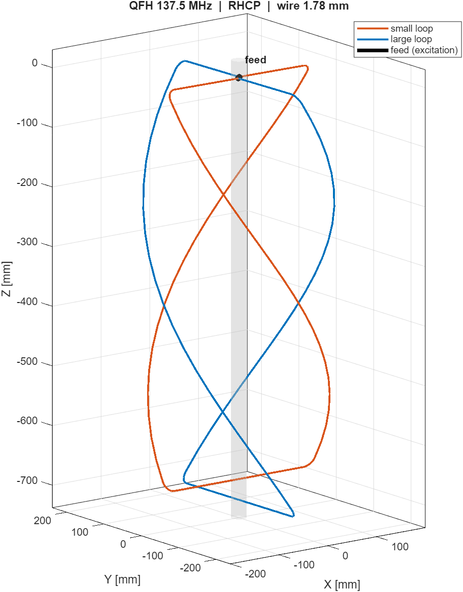

# QFH weather-satellite station: my own antenna and an all-discrete receiver

I'm Edy Grigore, an Electrical Engineering student at the University of
Twente. This is my personal project to receive weather satellites on 137 MHz
with hardware I designed myself: a QFH antenna and a superheterodyne receiver
built only from discrete parts (transistors, diodes, coils and capacitors, no
ICs in the signal path).

## Why I'm doing this

In my first year, the Module 4 project was to design an antenna and a
transmitter PCB. I really enjoyed that field, together with the High Frequency
Electronics, Electromagnetostatics and Electrodynamics courses, so I wanted to
go deeper: design my own antenna and my own receiver, and do the receiver fully
analog so I have to understand every stage at component level.

The NOAA satellites the receiver was designed for were switched off in 2025,
and the remaining Meteor-M satellites send a digital signal an analog FM
receiver cannot decode. So I test the antenna and the receiver separately: the
antenna with an SDR on Meteor-M, the receiver with recorded NOAA passes played
back through an ADALM-Pluto. More in the
[receiver README](fm_receiver/README.md#motivation).

## What's in here

| Folder | What it is | Status |
|---|---|---|
| [`qfh_matlab`](qfh_matlab) | MATLAB toolchain that designs the QFH antenna, exports it to NEC2 and prints a drilling template | antenna designed, simulated and built |
| [`fm_receiver`](fm_receiver) | the receiver design and its LTspice simulations, block by block up to the full chain | simulated from RF input to the ADC |
| [`pcb`](pcb) | the KiCad board for the receiver | designed and checked, ready to order |
| [`lrpt_decoder`](lrpt_decoder) | my own MATLAB analysis chain for Meteor-M LRPT recordings | working; taught me my signal was too weak |
| [`baseband_tools`](baseband_tools) | tools to check an SDR recording before decoding it | working |

## Highlights

- A superheterodyne receiver with about **130 dB** of gain: band-pass filter,
  LNA, mixer, a 25 MHz crystal oscillator multiplied ×5 to 125 MHz, a 12.9 MHz
  IF with four cascode stages, a limiter and a slope detector.
- Every block **simulated in LTspice** on its own, then connected, then the
  whole receiver from an FM input to the audio at the ADC.
- A **2-layer PCB** (180 × 75 mm, 196 parts) with the layout built around RF
  rules: an unbroken ground plane, a straight IF strip, tight tuned circuits
  and test points for block-by-block bring-up.
- The antenna toolchain reproduces its reference program **exactly** (all 127
  NEC wire cards identical) and adds a frequency correction found in simulation.

## What's next

Order and build the PCB, align it one block at a time, and feed it a recorded
satellite pass. On the reception side: an LNA and a 137 MHz SAW filter in
front of the SDR, then another try at Meteor-M.

After that, I want to close the loop with my own hardware on both ends: build
a second QFH antenna and an FM transmitter on my own PCB, and send information
between the two stations, on a frequency I'm allowed to transmit on.

## Tools

LTspice, KiCad 10, MATLAB R2025a, 4nec2 / NEC2, SatDump, an ADALM-Pluto SDR
and a miniVNA Tiny.

## Credits and license

This is my project. I used Claude (Anthropic) as an AI assistant along the
way; each folder's README says exactly what it helped with. The antenna code
is a MATLAB port of John Coppens' online QFH calculator and of QFH2nec, both
GPL-licensed, so `qfh_matlab` is GPL-3.0. Everything else is MIT licensed
(see [LICENSE](LICENSE)).
