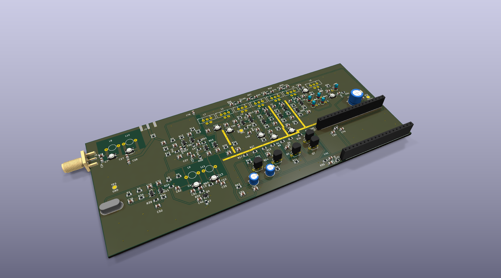
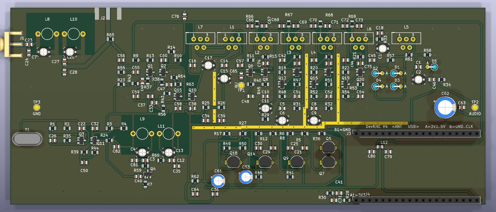

# PCB — discrete 137.9 MHz FM satellite receiver

This is the circuit board for the receiver I simulated in
[`../fm_receiver`](../fm_receiver). The board is built from that simulation:
its schematic was generated from the full-receiver netlist `sim12`, and if the
board and that netlist ever disagree, the netlist wins.



## The board at a glance

| | |
|---|---|
| Size | 180 × 75 mm, 2 layers, FR4 1.6 mm |
| Parts | 196, all on the top side |
| Bottom layer | one ground plane |
| Controller | ESP32-DevKitC V4 on a socket (its ADC digitizes the audio) |
| Supply | the DevKitC's 5V pin (really about 4.6 V), about 41 mA |
| Checks | KiCad DRC clean at a 0.254 mm clearance floor; schematic and board match pad for pad |



## Floorplan

```
+--------------------------------------------------------------------------+
| [SMA ant] BPF (2 air coils, | LNA | MIXER | == IF STRIP, 96 dB, straight |
|  plane cutouts) [SMA test]  | SMD | +T1   |  T2 [1][2][3][4] lim | DET T7 |
|-------- via wall ----------------------------------------------- via wall|
| LO CHAIN: xtal 25MHz | buffer | x5 (2 air coils) -> up into mixer LO port |
|                      AUDIO chain (2400 Hz, folds freely) <- from detector |
|  power entry / bulk filter          ESP32 module socket [USB over edge] > |
+--------------------------------------------------------------------------+
```

The weakest signals (microvolts) start at the left edge and the strongest
(volts) end at the right. The IF strip runs in a straight line with its input
and output at opposite ends, because with 96 dB of gain even a little coupling
from the output back to the input would make it oscillate.

## Layout rules I followed

- **The bottom layer is ground.** Everything is routed on top. A few short
  bottom-layer hops were unavoidable where a trace had to cross another; each
  one is listed and justified in the design log.
- **Shielding provisions for free.** Rows of ground vias between the IF stages
  and between the RF and the LO/audio sections, with exposed ground strips so a
  brass shield can be soldered on later if the strip oscillates.
- **Tight RF loops.** Every tuned circuit's parts sit right at its coil, and the
  LNA's emitter bypass is within about 5 mm of copper of the transistor. At VHF
  a few nanohenries of track change the tuning and the gain.
- **A real 50 ohm antenna input.** The SMA feeds the filter through a 1.5 mm
  coplanar line with ground on both sides.
- **Decoupling everywhere.** Every IF stage has its own 100 nF capacitors on its
  supply and on its cascode bias, fed through its own 10 ohm resistor, so the
  stages cannot talk to each other through the supply.
- **Test points for bring-up.** A second, unfitted SMA with a 0 ohm link at the
  filter→LNA seam (to measure the filter and the LNA separately on a VNA), an
  injection pad at the first IF stage, and a monitor pad on the audio.
- **No parts on the back and no mounting holes**, both on purpose.

The toroids (T37-6, 27 turns) and the air coils (5 mm diameter) use my own
footprints in `qfh_receiver.pretty`. The air-coil footprint keeps copper away
from under the coil, because a ground plane there would kill its Q.

## How I checked it

KiCad's design-rule check is clean at a 0.254 mm clearance floor. The
schematic was generated from the simulation netlist and compared with the board
pad by pad (418 connections, no differences). Every part value was checked
against a real catalogue part at Farnell. I also had the board reviewed by
independent AI review passes, which is how several of the issues below were
found.

## Issues found and fixed

- **Two TO-92 transistor types had base and emitter swapped** because a
  generic symbol used the wrong pin order. Lesson: check each footprint's pinout
  against the datasheet, not against the symbol library.
- **The ESP32 socket would not have powered anything.** The 5 V feed landed on
  a GPIO pin and the enable pin was grounded. I fixed it after checking the
  DevKitC pinout from several sources and every way the module could be
  plugged in.
- **The "5 V" supply is really 4.6 V**, because the DevKitC puts a Schottky
  diode after USB. I re-centred every bias divider in the simulation for 4.6 V
  instead of accepting lower gain.
- **Some specified trimmers did not exist as real parts.** Together with the
  board's own parasitics this pushed three tuned circuits to the end of their
  trimmer range. I re-split the fixed capacitor and the trimmer in each one so
  the trimmer now lands mid-range.
- **The LNA's emitter bypass capacitor was 20 mm from the transistor.** That
  is about 12 nH, which would have cost 4–5 dB of gain. It is now within 5 mm.

## Bring-up plan

1. Power only: check every DC voltage against `sim12`.
2. Local oscillator: 25 MHz at the crystal, then 125 MHz at the mixer.
3. Filter and LNA: fit the test SMA, remove the 0 ohm link, sweep them on the
   VNA. Expect about 39 dB of image rejection and an LNA gain of at least
   13.5 dB.
4. IF strip: with no signal, the limiter output should show only noise (a
   steady tone means it oscillates). Then inject 12.9 MHz at the test pad and
   align the tanks.
5. The whole chain: a recorded APT pass from the Pluto into the antenna input.

Expected trimmer settings: band-pass filter about 6.5 pF, ×5 multiplier about
5.4 pF, LO output about 5.8 pF. If one lands far from that, its coil probably
came out wrong.

## Ordering

The bill of materials with Farnell order codes is `gen/qfh_receiver_bom.csv`.
Every pF-range capacitor must be NP0/C0G, and the crystal must be a
fundamental-mode part. Both SMAs are edge-launch parts whose pads run to the
board edge on purpose, so the board house may ask about copper at the edge.

## Files

| File | What it is |
|---|---|
| `qfh_receiver.kicad_pro` / `.kicad_sch` / `.kicad_pcb` | the KiCad project, schematic and board |
| `qfh_receiver.kicad_dru` | custom design rules (edge clearance at the two SMAs) |
| `qfh_receiver.pretty/` | my footprints for the toroids and air coils |
| `gen/qfh_receiver_bom.csv` | the bill of materials |
| `img/` | board renders |
| [`DESIGN_LOG.md`](DESIGN_LOG.md) | the complete step-by-step design log |

## Attribution

This board is my project: I set the requirements and the layout rules, and I
approved every change. I will assemble, align and measure it myself. I used
Claude (Anthropic) as an AI assistant for the KiCad work: following my
requirements and reviews, it did most of the placement and routing by script,
ran the design checks and did independent review passes. The full step-by-step
record is in [`DESIGN_LOG.md`](DESIGN_LOG.md). The motivation for the project is
in the [receiver README](../fm_receiver/README.md).

Edy Grigore
